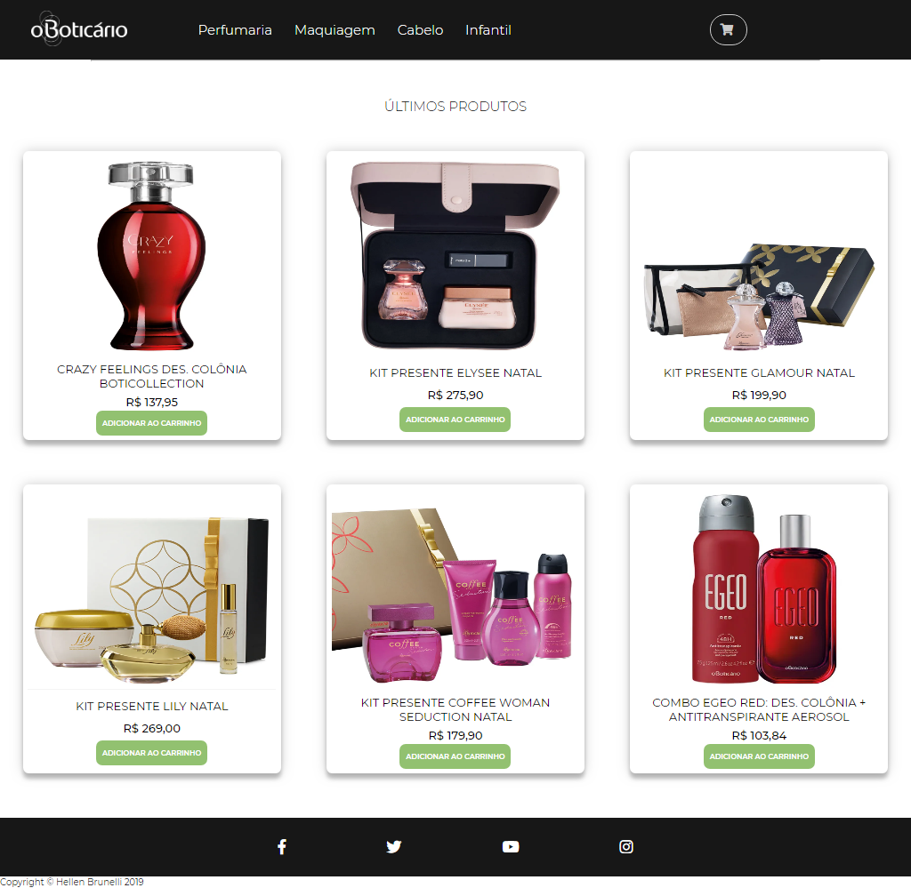
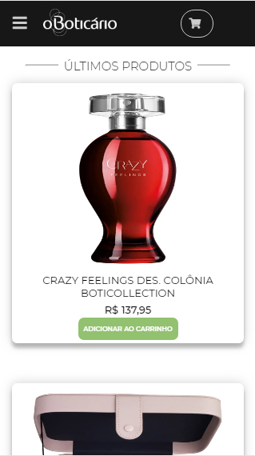

# Challenge O Boticário
> - Os produtos são consumidos de um Json via ajax.
> - Ao clicar no produto, o valor do mesmo deve ser adicionado ao carrinho.

Este projeto de e-commerce foi desenvolvido como parte do processo seletivo de O Boticário, e foi desenvolvido vanilla, em mobile first.
Utilizei o pré processador Sass

 

 

## Contato

Hellen Brunelli
[Linkedin](https://www.linkedin.com/in/hellenbrunelli/) | [Github](https://github.com/HellenBrunelli?tab=repositories)